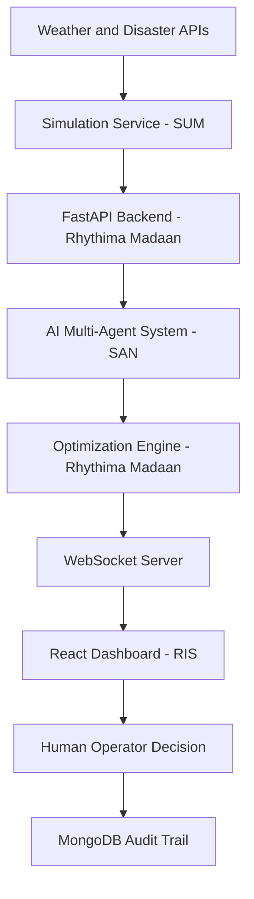

# Smart Grid Human-in-the-Loop Power Cut Optimization

## Project Description
This system is a **Human-in-the-Loop (HITL) Power Cut Optimization System** designed for stressed power grids. During extreme demand events like **heatwaves or disasters**, electricity demand often exceeds available supply.

This project provides grid operators with **AI-ranked power management strategies and mathematical optimization plans** while ensuring **critical infrastructure remains powered**.

The core philosophy is **shared autonomy**: machines manage the computational complexity of **real-time optimization and risk analysis**, while **human operators retain final control over high-risk decisions**.

---

# System Architecture
The system operates as an **end-to-end pipeline**, moving from raw environmental signals to **human-validated execution**.



## Components

### Weather and Disaster APIs
Provides real-world signals regarding environmental stress.

### Simulation Service (SUM)
Generates real-time grid telemetry and data streams.

### AI Multi-Agent System (SAN)
Conducts parallel risk analysis using LLM agents and ML models.

### Optimization Engine (RHY)
Computes feasible load-shedding plans using constraint solvers.

### FastAPI Backend
Manages state, WebSockets, and the HITL interrupt gate.

### React Dashboard (RIS)
Provides the interface for human decision-making and real-time monitoring.

---

# Key Features

## Multi-Agent Pipeline
Built with **LangGraph** to perform parallel analysis of **grid health, demand trends, and disaster risks**.

- **Intake Agent** – Preprocesses and validates raw grid telemetry  
- **Parallel Analysis** – Concurrent execution of Grid Health, Demand, and Disaster agents  
- **ML-LLM Fusion** – Combines **Groq-powered LLM reasoning (Llama 3.3 70B)** with **RandomForest and IsolationForest** pattern detection  

---

## Mathematical Optimization
Uses **Google OR-Tools** to generate **three distinct strategies** for every deficit scenario.

### Minimum Disruption
Mathematically optimized to minimize the total MW cut.

### Industrial Priority
Protects residential cooling and services by prioritizing industrial cuts.

### Residential Rotation
Distributes cuts across residential zones to maintain industrial continuity.

---

## Human-in-the-Loop Interrupt
A **hard gate implemented via LangGraph** pauses the system during **high-risk scenarios**.

The system **requires explicit operator approval via WebSockets** before any load-shedding plan is executed.

---

## Real-Time Auditing
Full persistence of **grid states, AI analyses, and human decisions** in **MongoDB**.

This ensures:

- Traceability  
- Accountability  
- Dataset generation for future ML model training  

---

# Tech Stack

| Layer | Technology |
|------|------------|
| Frontend | React, Vite, Recharts, Tailwind CSS, Shadcn UI |
| Backend | FastAPI, WebSockets, Python 3.11+ |
| AI Orchestration | LangGraph, LangChain |
| LLM Inference | Groq (Llama 3.3 70B / Llama 3.1 8B) |
| Optimization | Google OR-Tools (SCIP Solver) |
| Database | MongoDB (Motor Async Driver) |
| ML Models | Scikit-Learn (RandomForest, IsolationForest) |

---

# Repository Structure

```
smart-grid-system/
├── backend/            # FastAPI server, WebSocket manager, and core logic
├── ai_agents/          # LangGraph workflow and agent definitions
├── ml/                 # Machine learning models and training logic
├── optimizer/          # OR-Tools constraint optimization implementation
├── simulation/         # Grid telemetry simulator and external API integration
└── frontend/           # React dashboard and UI components
```

---

# Installation and Setup

## Backend Setup

Navigate to the backend directory:

```bash
cd backend
```

Install required Python packages:

```bash
pip install fastapi uvicorn motor ortools langgraph langchain-groq scikit-learn
```

Create a `.env` file:

```
GROQ_API_KEY=your_api_key
MONGODB_URI=your_mongodb_uri
MONGODB_DB=smart_grid
```

Start the backend server:

```bash
uvicorn main:app --reload
```

---

# Frontend Setup

Navigate to the frontend directory:

```bash
cd frontend
```

Install dependencies:

```bash
npm install
```

Start the development server:

```bash
npm run dev
```

---

# Running the Simulator

To feed simulated grid data into the system, run:

```bash
python simulation/simulator.py
```

---

# Team Lowkirkinuely

- **RIS** — Frontend Dashboard Development  
- **Rhythima Madaan (RHY)** — Backend API and Optimization Engine  
- **SAN** — AI Agent Analysis System  
- **SUM** — Data Simulation and External APIs  

---

# License

This project was developed for **hackathon purposes** and is licensed under the **MIT License**.